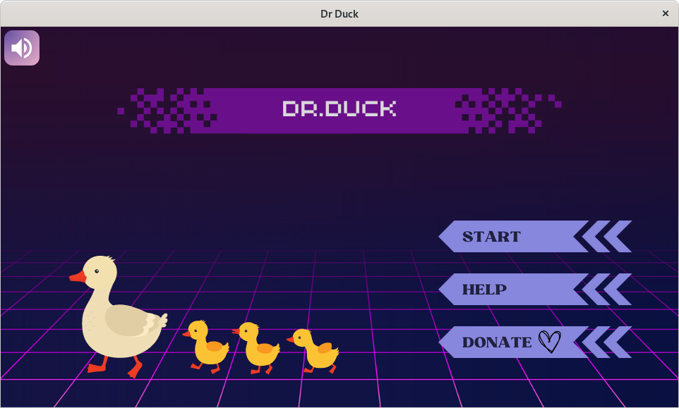
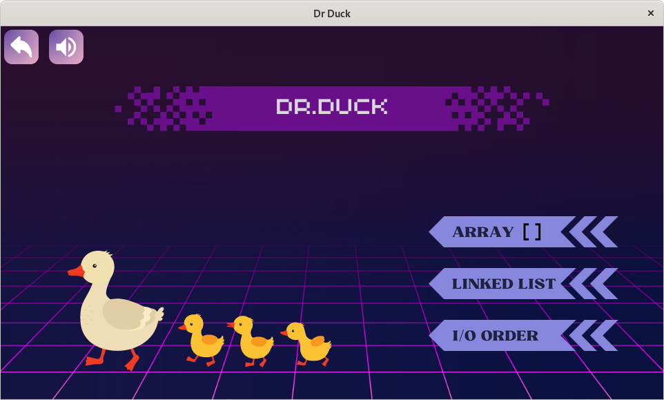
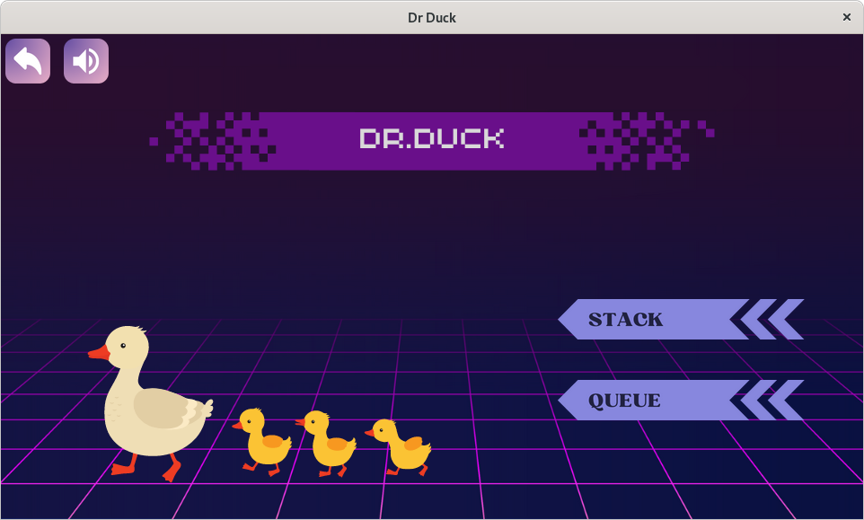

# Dr Duck
- CS162 projects.
- This is a solo project for the course CS162 - Introduction to Computer Science II.
- Visualize data structures.
- In this project, I will do a data visualization application.
## FEATURES 
#### Static array / dynamic array / singly, doubly, circular linked list / stack / queue
- Init from file
- Randomized data
- Insert / delete / search / update / push / pops
- Highlight code
- Custom
#### Run step by step
#### Speed up and slow down
#### Sound 
#### Graphics
#### Open with file 
- Data is storing in folder saving/
## REQUIRED
- SDL2
- SDL\_image
- SDL\_ttf
- https://github.com/nlohmann/json
- CMAKE 3.12+
- makefile
- C++17
## INSTALL 
- At first you need to install C++17, makefile, CMake:
```
sudo apt update 
sudo apt install build-essential
sudo apt install make 
sudo apt install cmake 
```
- Install SDL2 and external libraries
```
sudo apt install libsdl2-dev
sudo apt install libsdl2-ttf-dev
sudo apt install libsdl2-image-dev
git clone https://github.com/nlohmann/json.git 
cd json
mkdir build
cd build
cmake ..
make
sudo make install
```

- After installed, download the repository and call make.
```
git clone https://github.com/qvanle/drDuck
cd drDuck 
make 
```
## Usage
### 1. After call make, a window will pop up

- If you don't like the sound you can turn off it (the button is on the top-left of screen).
- Click "start" button to continue.
- Tutorial and donate are still in developing.
### 2. You have 3 type of data structures 

1. Array.
2. Linked list.
3. In and out order (stack and queue).
#### Array 

1. Static array.
2. Dynamic array.
#### Linked list 

1. Singly linked list.
2. Doubly linked list.
3. Circular linked list.
#### I/O order 

1. Stack.
2. Queue.
## Demonstration

## Documentation

